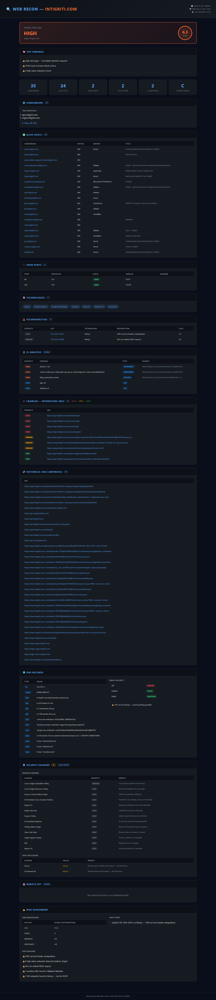
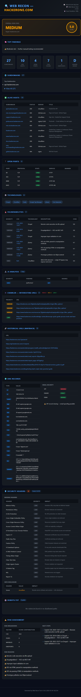

# 🔍 Web Recon Tool

> **"The system isn't secure — it's just waiting for you."**

A Python-based web reconnaissance tool that goes beyond simple scanning — it **analyzes, prioritizes, and explains** findings like a real penetration tester would.


---

## 📸 Sample Reports

| Intigriti.com | HackerOne.com |
|---|---|
|  |  |

---

## 🧠 Why This Tool?

Most recon tools dump raw data. This tool thinks like a pentester:

- 🎯 **Prioritizes endpoints** — HIGH / MEDIUM / LOW (admin, login, api)
- 📊 **Risk scoring** — CVE-based, not just URL counting
- 🔍 **Top Findings** — actionable summary at the top of every report
- 🛡️ **Security posture** — headers, DNS, email security in one place
- 📁 **Professional HTML report** — client-ready output

---

## 🚀 Features

| Module | Description |
|---|---|
| **Subdomain Enumeration** | Passive (crt.sh, HackerTarget, RapidDNS, AlienVault) + Active brute force |
| **Live Host Detection** | HTTP probe with status, server, title extraction |
| **Port Scanning** | Async scanning + banner grabbing |
| **Technology Fingerprinting** | Headers + HTML pattern matching |
| **JS Analysis** | API endpoints, secrets, AWS keys, JWT tokens from JS files |
| **Crawler** | Depth-based crawling with HIGH/MEDIUM/LOW endpoint classification |
| **Wayback Machine** | Historical URL discovery from 3 sources |
| **DNS Recon** | 18 record types + SPF/DMARC/DKIM email security check |
| **Security Headers** | 25 headers analyzed, graded A-F |
| **CVE Correlation** | Detected technologies mapped to known CVEs |
| **Risk Engine** | Score + priority + reasoning — CVE-driven, not noise-driven |
| **HTML Report** | Professional dark-theme report with Top Findings |

---

## 📦 Installation

```bash
git clone https://github.com/princephantom-cm/web-recon-tool.git
cd web-recon-tool
pip install -r requirements.txt
```

---

## ⚙️ Usage

```bash
# Basic scan
python main.py target.com

# With crawler depth
python main.py target.com -d 2

# HTML + JSON output
python main.py target.com -o both
```

---

## 🗂️ Project Structure

```
web-recon-tool/
├── core/
│   ├── port_scanner.py       # Async port scanning + banner grabbing
│   ├── subdomain_enum.py     # 4 passive sources + brute force
│   ├── tech_fingerprint.py   # Technology detection
│   ├── vuln_correlator.py    # CVE mapping
│   ├── risk_engine.py        # Risk scoring + prioritization
│   ├── dns_recon.py          # DNS records + email security
│   └── security_headers.py  # 25 security headers analysis
├── modules/
│   ├── passive/
│   │   ├── wayback.py        # Historical URL discovery
│   │   ├── js_analyzer.py    # JS file analysis
│   │   └── robots_sitemap.py # robots.txt + sitemap parsing
│   └── active/
│       ├── http_probe.py     # Alive host filtering
│       └── crawler.py        # Endpoint discovery + prioritization
├── output/
│   ├── html_report.py        # Professional HTML report
│   └── json_report.py        # JSON output
└── main.py                   # Pipeline orchestrator
```

---

## 📊 Report Sections

- **Top Findings** — Dynamic 4-5 bullet summary
- **Subdomains** — All found + alive/dead count
- **Alive Hosts** — Status, server, page title
- **Open Ports** — Protocol, state, banner
- **Technologies** — Detected stack
- **Vulnerabilities** — CVEs with CVSS scores
- **JS Analysis** — Endpoints, secrets, API keys
- **Crawler** — HIGH/MEDIUM/LOW prioritized endpoints
- **Wayback URLs** — Historical interesting paths
- **DNS Records** — 18 types + SPF/DMARC/DKIM
- **Security Headers** — Grade + missing headers
- **Risk Assessment** — Breakdown + next steps

---

## ⚠️ Disclaimer

This tool is intended for **authorized penetration testing and security research only**.
Do not use against systems you do not have explicit permission to test.
The author is not responsible for any misuse.


---

## 👤 Author

**Prince Dubey**
- eJPT Certified
- TryHackMe Top 8%
- Bug Bounty Hunter
- [GitHub](https://github.com/princephantom-cm)
